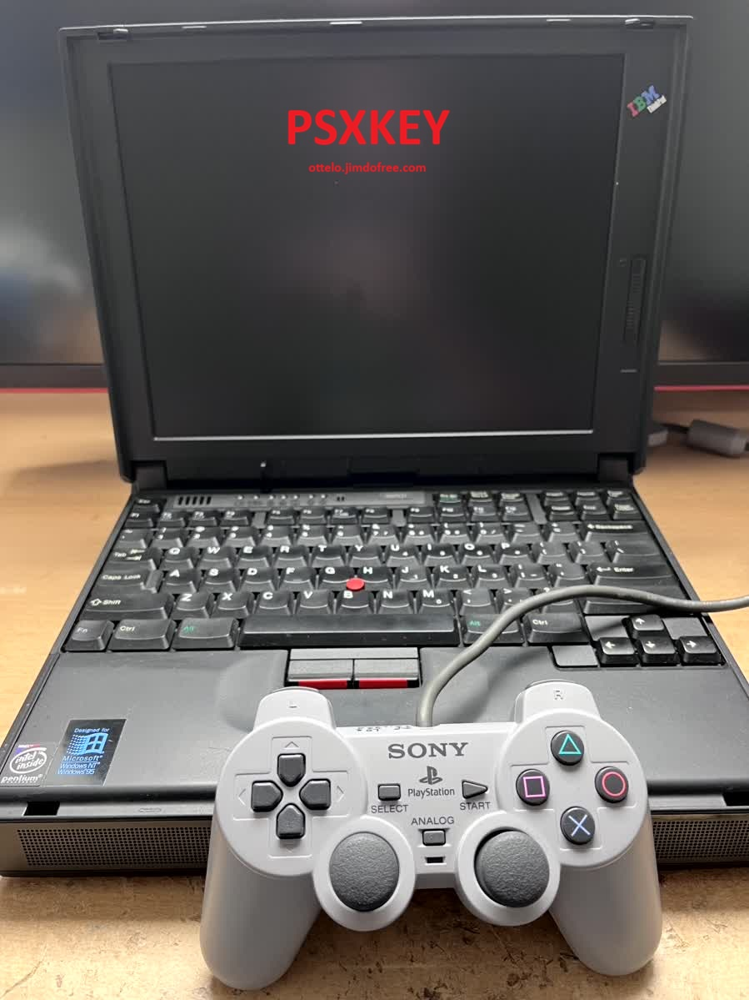
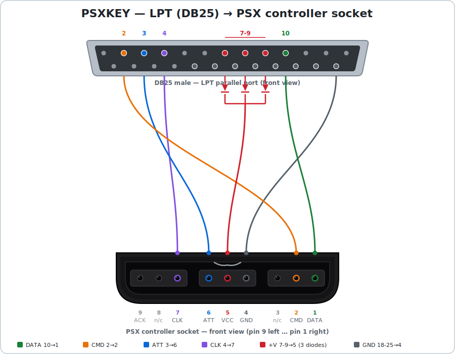
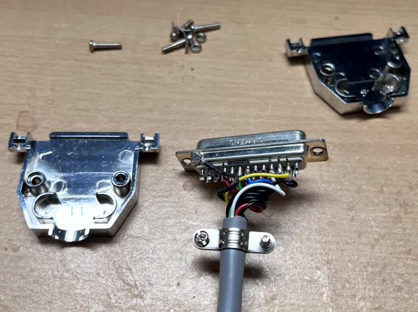
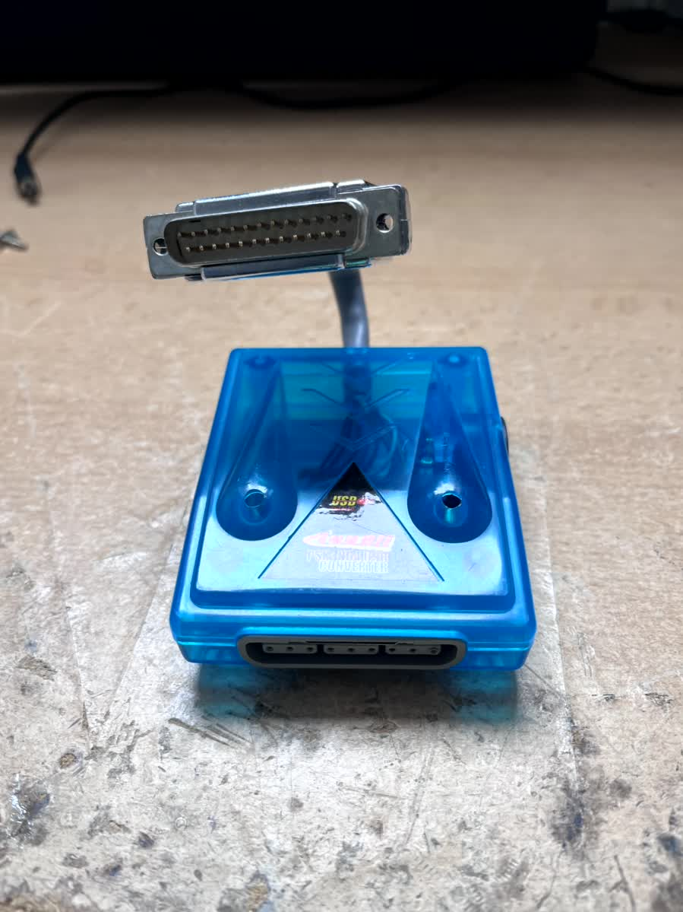
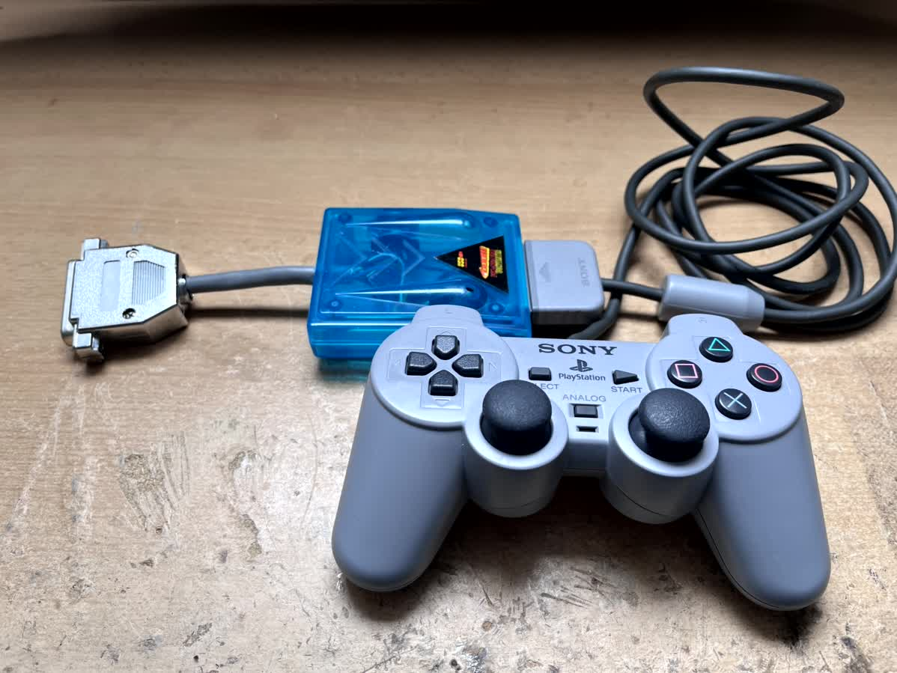

# PSXKEY — PlayStation Controller → Keyboard TSR for MS-DOS

<p align="center">
  
</p>

PSXKEY is a small resident driver (TSR) for MS-DOS that reads a **PlayStation (PSX/PS1)
controller through the parallel (LPT) port** and injects the mapped buttons as **keyboard
keystrokes**. This lets you play DOS games with a PSX gamepad.

Originally built and tested on an **IBM ThinkPad 380XD** running MS-DOS (Windows 98 DOS,
boot mode **XMC** = HIMEM only, **no EMM386**). Do not run it under EMM386 or any V86-mode
memory manager — the V86 layer breaks the direct hardware I/O this driver depends on.

## How it works

Keys are injected at the **INT 9 / KBC level** using keyboard-controller command `0xD2`,
not into the BIOS keyboard buffer (INT 16h). This is what makes it work with games that
read the keyboard hardware directly (port `0x60` / their own INT 9 handler), such as
**King's Chase** (Timegate) and **Commander Keen**. Plain BIOS-buffer injection was not
enough for those titles.

## Building

Requires [NASM](https://www.nasm.us/):

```
nasm -f bin PSXKEY.asm -o PSXKEY.COM
```

The build date is embedded automatically (via NASM's `__?DATE?__`) and printed on startup
as `build YY-MM-DD`.

## Usage

| Command      | Action                                                                    |
|--------------|---------------------------------------------------------------------------|
| `PSXKEY`     | Install the driver (reads `PSXKEY.INI`).                                   |
| `PSXKEY /U`  | Unload the driver.                                                         |
| `PSXKEY /?`  | Show help including the wiring diagram.                                    |

Double-loading is prevented via an INT 2Fh multiplex ID (`0xC9`). Unloading restores INT 8
and INT 2Fh and frees the memory; it reports **"cannot unload"** if another TSR was loaded
after PSXKEY (since the interrupt chain can no longer be safely unhooked).

## Hardware / LPT wiring (DB25 → PSX pad)

The default port base is `0x3BC` (LPT1 on the ThinkPad 380XD); it is configurable in the
INI. The status register is at base + 1.

| LPT pin              | Signal / bit         | PSX pad          | PSX pin |
|----------------------|----------------------|------------------|---------|
| Pin 2  (D0, `0x01`)  | data out             | CMD              | 2       |
| Pin 3  (D1, `0x02`)  | data out             | ATT (attention)  | 6       |
| Pin 4  (D2, `0x04`)  | data out             | CLK (clock)      | 7       |
| Pin 10 (Status bit6, `0x40`) | data in      | DATA             | 1       |
| Pin 7-9 (D5-D7, `0xF0`, via diodes) | held high | +V (3.3–5 V supply) | 5 |
| Pin 18-25            | ground               | GND              | 4       |

<p align="center">
  
</p>

Looking into the PSX socket from the front, the pins run **9 on the left to 1 on the right**.
Pins 3, 8 and 9 are not used. No clock resistor is needed — the driver bit-bangs the clock
with its own delays, so clean edges are fine.

### Building the adapter

<p align="center">
  
  
  
</p>

The adapter is a simple DB25-to-PSX-connector cable following the wiring above — the diodes
on pins 7-9 feed the controller's supply voltage.

## PSX protocol (verified)

- SPI-like, **LSB first**, buttons are **active-low** (`0` = pressed).
- Poll = 5 bytes: `0x01, 0x42, 0x00, 0x00, 0x00`.
- `recv[3]` = Buttons 1: bit0 Select, 1 L3, 2 R3, 3 Start, 4 Up, 5 Right, 6 Down, 7 Left
- `recv[4]` = Buttons 2: bit0 L2, 1 R2, 2 L1, 3 R1, 4 Triangle, 5 Circle, 6 Cross, 7 Square
- Bit-bang: CLK idles high; per bit → CLK low + set CMD, read DATA, CLK high.
  Delay loop `cx = 0x300`.

## Configuration (`PSXKEY.INI`)

The INI file has the same base name as the COM and is located via the PSP environment path.
If it is missing, a default INI is created automatically.

- Line format: `button = key`.
- Lines starting with `[`, `;`, or `//` are ignored.
- `port = 0x3BC` (or `lpt = ...`) sets the LPT port (hex, `0x` optional).

**Buttons:** `up down left right start select cross circle triangle box l1 l2 r1 r2`

**Keys:** letters, digits, `space return enter esc tab`, `up down left right`, `ctrl alt shift`

Example (also the generated default):

```ini
[psx]
port = 0x3BC
box = a
cross = x
circle = o
triangle = b
select = space
start = return
l1 = 1
l2 = 2
r1 = 3
r2 = 4
up = up
down = down
left = left
right = right
```

## Design notes / solved problems

- **Timer hook (INT 8, ~18.2 Hz).** The controller is polled on **every** tick. `STI` is
  set during the poll (the long bit-bang phase) so the ISR does not block interrupts (which
  would cause stuttering); the injection phase stays `CLI`. Re-entrancy is guarded by a
  `busy` flag.
- **Make/Break injection.** A make code is sent on press and a break code on release, edge-
  detected via the `cnt[]` state array. There is no auto-repeat — the game holds the state
  itself.
- **KBC `0xD2` injection:** `out 0x64, 0xD2` → wait until the input buffer is empty →
  `out 0x60, scancode`. Wait loops use a **timeout of `cx = 0x400`** (not `0xFFFF`, which
  could cause ~1 s of CLI spin / stutter on release).
- **Wait for the byte to be consumed (OBF wait) after every byte** (`kbcbyte`, label `.w3`):
  after `out 0x60`, briefly `sti` and wait until the game has read the output buffer
  (port `0x64` bit0 clear, timeout `cx = 0x400`), then `cli`. This is required because the
  whole injection otherwise runs under `CLI`, so IRQ1 never fires and, for multi-byte
  sequences (the `E0` prefix of the arrow keys), the second byte overwrites the first in the
  1-byte KBC output buffer before it is read → **lost break codes**. Symptom: Commander Keen
  kept walking indefinitely (make without break), especially when releasing several buttons
  at once (e.g. walk + jump); pressing the direction again on its own would stop him.
- **Self-healing.** `cnt[]` (the last state actually sent) is only updated when `kbcbyte`
  succeeded (CF = 0). On timeout, `cnt` is left unchanged so the next tick retries. This
  prevents stuck keys / a character spinning forever.
- **Arrow keys** are sent as **E0-extended** codes (real cursor keys). If a game needs the
  numpad codes instead, change the arrows' ext flag in `nvtab` from `1` to `0`.
- ASCII values are irrelevant (INT 9 uses scancodes); letters are lower case.

## Known limitations / ideas

- **Analog pad** (ID `0x73`) returns 6 data bytes; the button bits stay in `recv[3]`/`recv[4]`,
  and only digital input is used for now.
- Only **one controller** (pad 1) is supported; a second pad is not implemented.
- Optional per-INI configurable repeat/delay for normal keys could be added.

## Source map (key routines)

- `isr8` — timer ISR: poll + edge detect + make/break.
- `kbcbyte` — the `0xD2` injection (timeout + carry flag + OBF wait).
- `pollpad` / `xchg` — the bit-bang transfer.
- `parse` / `mapval` / `matchbtn` / `parsehex` — INI parsing.
- `int2f` — INT 2Fh multiplex handler.
- `unload` — TSR removal.
- `getini` — INI loading (including default-INI creation).
- Everything before the `install` label is resident; the TSR keep size is the `install`
  offset in paragraphs.

## Author

ottelo — [ottelo.jimdofree.com](https://ottelo.jimdofree.com)
