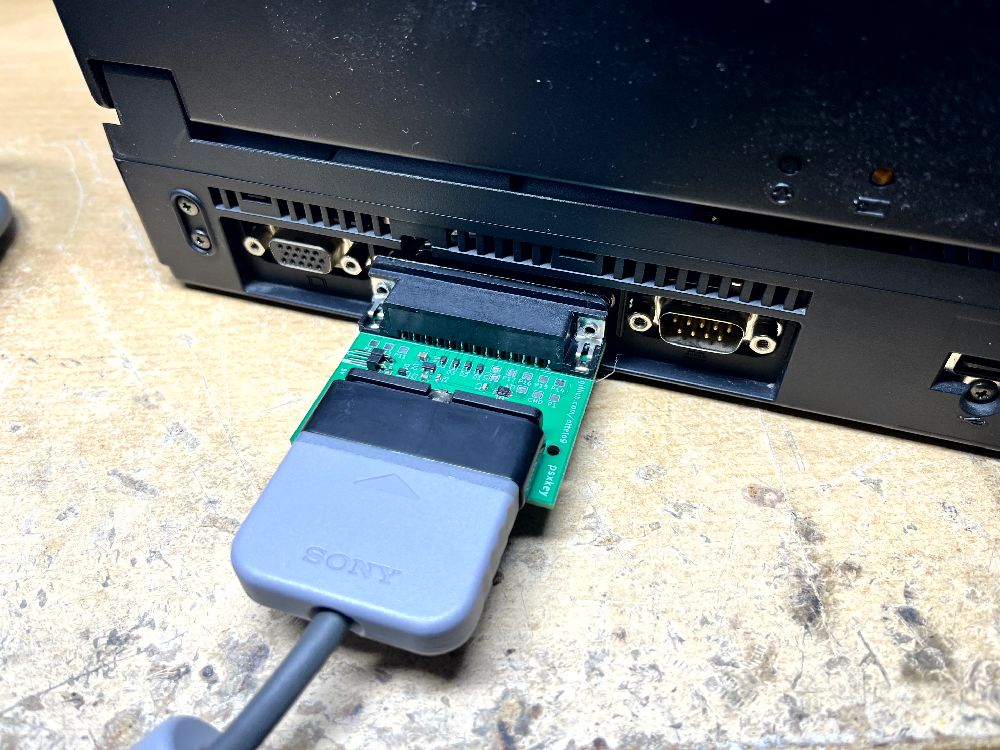
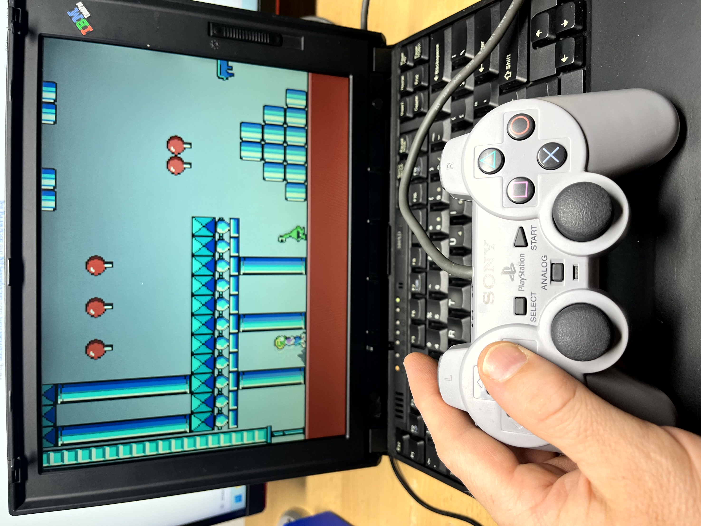
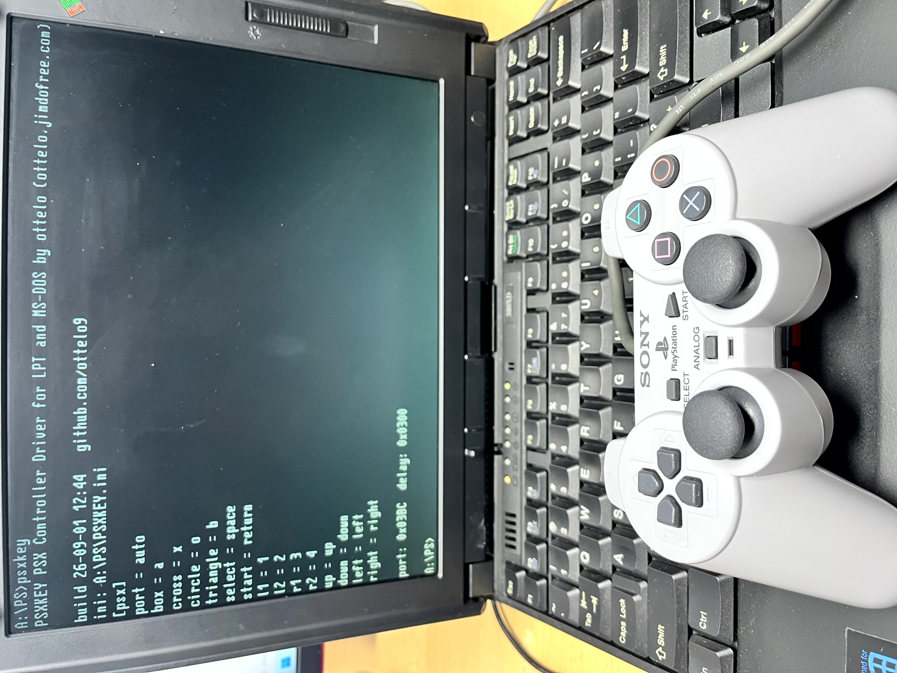
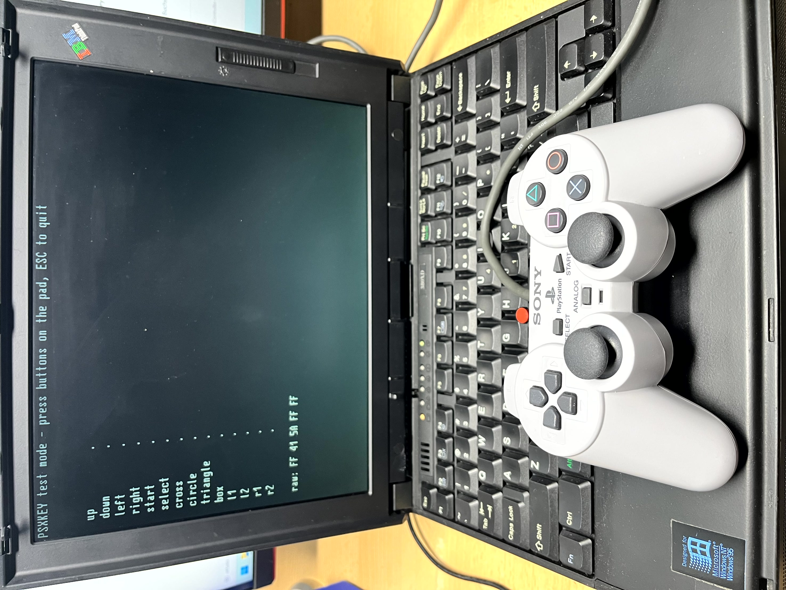
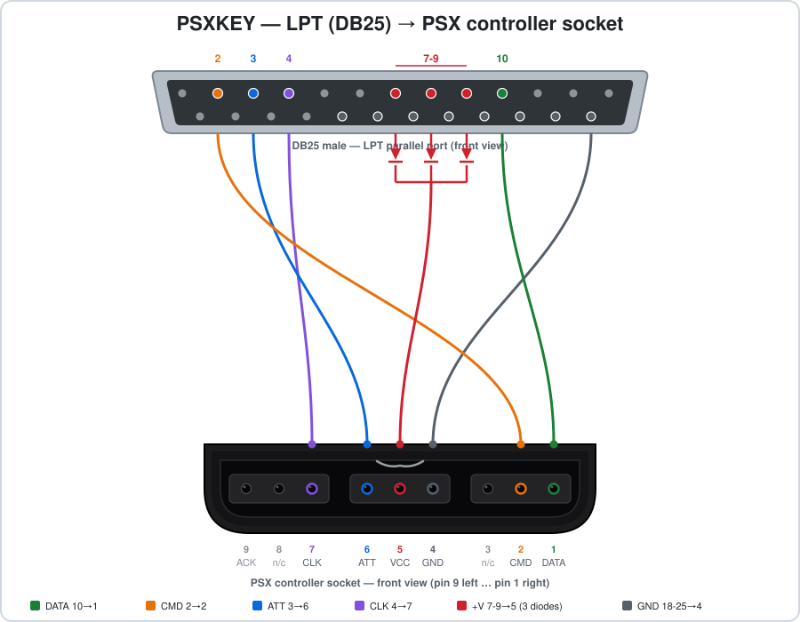

# PSXKEY — PlayStation Controller → Keyboard TSR for MS-DOS

<p align="center">
  
</p>

<a href="https://ottelo9.github.io/psxkey/">HELP PAGE in German and English</a>

PSXKEY is a small resident driver (TSR) for MS-DOS that reads a **PlayStation (PSX/PS1)
controller through the parallel (LPT) port** and injects the mapped buttons as **keyboard
keystrokes**. This lets you play DOS games with a PSX gamepad.

Originally built and tested on an **IBM ThinkPad 380XD** and **Toshiba Satellite Pro 4600** running MS-DOS (Windows 98 DOS,
boot mode **XMC** = HIMEM only, **no EMM386**). Do not run it under EMM386 or any V86-mode
memory manager — the V86 layer breaks the direct hardware I/O this driver depends on.

## How it works

Keys are injected at the **INT 9 / KBC level** using keyboard-controller command `0xD2`,
not into the BIOS keyboard buffer (INT 16h). This is what makes it work with games that
read the keyboard hardware directly (port `0x60` / their own INT 9 handler), such as
**King's Chase** (Timegate) and **Commander Keen**. Plain BIOS-buffer injection was not
enough for those titles.

<p align="center">
  
</p>

## Building

Requires [NASM](https://www.nasm.us/):

```
nasm -f bin PSXKEY.asm -o PSXKEY.COM
```

The build date is embedded automatically (via NASM's `__?DATE?__`) and printed on startup
as `build YY-MM-DD`.

## Usage

| Command      | Action                                                                    |
|--------------|---------------------------------------------------------------------------|
| `PSXKEY`     | Install the driver (reads `PSXKEY.INI`).                                   |
| `PSXKEY /U`  | Unload the driver.                                                         |
| `PSXKEY /?`  | Show help including the wiring diagram.                                    |
| `PSXKEY /T`  | Test mode: show all buttons live, without installing.                      |

Double-loading is prevented via an INT 2Fh multiplex ID (`0xC9`). Unloading restores INT 8
and INT 2Fh and frees the memory; it reports **"cannot unload"** if another TSR was loaded
after PSXKEY (since the interrupt chain can no longer be safely unhooked).

### Startup output

The driver prints its banner, the **full path of the INI it loaded** and that file's
contents, so you can see at a glance which configuration is actually in effect:

```text
PSXKEY PSX Controller Driver for LPT and MS-DOS by ottelo (ottelo.jimdofree.com)
build 26-09-01 12:24   github.com/ottelo9
ini: C:\TOOLS\PSXKEY.INI
[psx]
port = auto
box = a
cross = x
...
port: 0x0378
```

<p align="center">
  
</p>

The listing is dumped from the same buffer the parser reads, so it shows what the driver
really saw — not a separate copy. The last line is the LPT port the driver ended up
using, which is what you want to see when `port = auto` is in effect. If no INI was found,
`psxkey: PSXKEY.INI not found - created default.` is printed first, followed by the path
and contents of the file that was just created.

### Test mode (`/T`)

`PSXKEY /T` checks the adapter and the pad without installing anything. It clears the
screen, lists the 14 buttons and marks each one `*` while it is held and `.` while it is
not. The five raw response bytes are shown underneath, so you can tell a wiring fault from
a mapping problem. ESC quits and restores the screen.

```text
PSXKEY test mode - press buttons on the pad, ESC to quit

  up          .
  down        *
  left        .
  ...

  raw: FF 41 5A FF DF
```

<p align="center">
  
</p>

Test mode runs before the interrupts are hooked, but after the INI has been read, so
`port = auto` and `delay` apply here as well. It refuses to run while PSXKEY is already
resident — the installed copy polls the same port from the timer interrupt and the two
would corrupt each other's transfers. Unload with `/U` first.

## PSKEY PSX-LPT-Adapter/Converter
I’m currently working on a ready2use adapter. I’ll then be putting it up for sale on eBay or similar sites.


## Hardware / LPT wiring (DB25 → PSX pad)

The default port base is `0x3BC` (LPT1 on the ThinkPad 380XD); it is configurable in the
INI. The status register is at base + 1.

| LPT pin              | Signal / bit         | PSX pad          | PSX pin |
|----------------------|----------------------|------------------|---------|
| Pin 2  (D0, `0x01`)  | data out             | CMD              | 2       |
| Pin 3  (D1, `0x02`)  | data out             | ATT (attention)  | 6       |
| Pin 4  (D2, `0x04`)  | data out             | CLK (clock)      | 7       |
| Pin 10 (Status bit6, `0x40`) | data in      | DATA             | 1       |
| Pin 6-9 (D4-D7, `0xF0`, via diodes) | held high | +V (3.3–5 V supply) | 5 |
| Pin 18-25            | ground               | GND              | 4       |

<p align="center">
  
</p>

Looking into the PSX socket from the front, the pins run **9 on the left to 1 on the right**.
Pins 3, 8 and 9 are not used.

The supply for the controller is taken from **four** data lines, LPT pins 6-9 (D4-D7). The
driver holds them permanently high — `POWER equ 0xF0` is OR-ed into every byte written to
the data register, so they never drop, not even during the bit-bang. Each pin gets its own
diode, and the cathodes are tied together to PSX pin 5. The diodes keep the outputs from
back-feeding each other and drop the 5 V logic level to roughly 4.3 V (silicon) or 3.3–4 V
under load with Schottky types. Using four pins in parallel is not cosmetic: a single LPT
output cannot supply a controller, and the more drivers share the load, the less the
voltage sags. No clock resistor is needed — the driver bit-bangs the clock
with its own delays, so clean edges are fine.

### LPT port mode and IRQ

**Mode:** set the parallel port to **SPP** in the BIOS setup — it may also be called
*Normal*, *Standard*, *Output only*, *AT* or *Printer*. The driver writes the data register
(base) as an output and reads pin 10 through the status register (base + 1). It never
touches the control register at base + 2, so it never enables bidirectional mode and never
switches direction — the data lines always drive.

*EPP* and *ECP* usually work too, because those ports come up in SPP-compatible mode after
reset, but they add a FIFO and mode logic that some chipsets (and some ECP DMA drivers)
leave in a non-compatible state. If the pad is not detected, SPP is the first thing to try.

**IRQ:** PSXKEY does **not** use the parallel port interrupt. It polls the controller from
the timer interrupt (INT 8, ~18.2 Hz), so no IRQ needs to be assigned to the port and no
conflict with another card matters. Note the flip side: pin 10 (/ACK) is the port's own
interrupt line, and PSXKEY toggles it constantly while reading data. If some earlier
program has set the interrupt-enable bit (base + 2, bit 4), every data bit will fire a
spurious IRQ7. Leave the port interrupt disabled and do not load a printer driver that
enables it.

To find out which IRQ the port is assigned anyway:

- **BIOS setup** — the parallel port entry lists base address and IRQ together.
- **MSD.EXE** (Microsoft Diagnostics, ships with DOS 6 / Windows) → *IRQ Status* and
  *LPT Ports*.
- **Windows 9x** → Device Manager → *Ports (COM & LPT)* → *Printer Port* → *Resources*.
- Typical defaults: `0x3BC` and `0x378` → **IRQ 7**, `0x278` → **IRQ 5**.

The base addresses the BIOS actually found are stored in the BIOS data area at `0040:0008`
(four 16-bit words, LPT1-LPT4). In DEBUG:

```
-d 40:08 L8
```

The first word is LPT1 — on the ThinkPad 380XD that is `BC 03`, i.e. `0x3BC`, which is the
driver's default and can be overridden with `port =` in the INI.

### Building the adapter

The adapter is a simple DB25-to-PSX-connector cable following the wiring above — the diodes
on pins 6-9 feed the controller's supply voltage.

## PSX protocol (verified)

- SPI-like, **LSB first**, buttons are **active-low** (`0` = pressed).
- Poll = 5 bytes: `0x01, 0x42, 0x00, 0x00, 0x00`.
- `recv[3]` = Buttons 1: bit0 Select, 1 L3, 2 R3, 3 Start, 4 Up, 5 Right, 6 Down, 7 Left
- `recv[4]` = Buttons 2: bit0 L2, 1 R2, 2 L1, 3 R1, 4 Triangle, 5 Circle, 6 Cross, 7 Square
- Bit-bang: CLK idles high; per bit → CLK low + set CMD, read DATA, CLK high.
  Delay loop `cx = 0x300`.

## Configuration (`PSXKEY.INI`)

The INI file has the same base name as the COM and is located via the PSP environment path.
If it is missing, a default INI is created automatically.
Both the path and the contents of the INI in effect are printed at startup.

- Line format: `button = key`.
- Lines starting with `[`, `;`, or `//` are ignored.
- `port = 0x3BC` (or `lpt = ...`) sets the LPT port (hex, `0x` optional).
- `port = auto` probes for the controller automatically (see below). This is the
  default in the generated INI.
- `delay = 0x300` sets the bit-bang delay loop count (hex). Omit it and `port = auto`
  finds a working value by itself.

**Buttons:** `up down left right start select cross circle triangle box l1 l2 r1 r2`

**Keys:** letters, digits, `space return enter esc tab`, `up down left right`, `ctrl alt shift`

Example (also the generated default):

```ini
[psx]
port = auto
box = a
cross = x
circle = o
triangle = b
select = space
start = return
l1 = 1
l2 = 2
r1 = 3
r2 = 4
up = up
down = down
left = left
right = right
```

### Automatic port detection (`port = auto`)

With `port = auto` the driver finds the port itself. It reads the LPT base addresses the
BIOS detected from the BIOS data area at `0040:0008` (up to four words, LPT1-LPT4) and
probes each one in turn: power the pad, wait for it to settle, then run a normal poll and
check whether the third response byte is `0x5A`. That byte is the pad's fixed "data
follows" marker, so it only appears if a controller really answered — an empty or wrong
port returns `0xFF`.

The first port that answers is used. If none does, the driver falls back to the first base
address the BIOS reported and prints

```text
psxkey: auto - no pad found, using port: 0x0378
```

The port actually in use is printed on every start, auto or not, together with the timing:

```text
port: 0x0378  delay: 0x1800
```

If the probe fails, the five raw response bytes are printed as well, which tells you where
to look: `FF FF FF FF FF` means DATA never went low (no answer at all), `00 00 00 00 00`
means DATA is stuck at ground, and anything containing `5A` in the third position means the
pad did answer and only the detection threshold was off.

### Bit-bang timing (`delay`)

The clock is bit-banged with a plain counting loop, so its speed follows the CPU. What
works on a 233 MHz Pentium can be far too fast on a 1 GHz machine, and then the pad never
answers at all — the symptom is `raw: FF FF FF FF FF`, exactly as if nothing were plugged
in. `port = auto` therefore sweeps several loop counts per port
(`0x300, 0x100, 0x80, 0x800, 0x1800, 0x4000`) and keeps the first one the pad responds to.

Set `delay = ...` in the INI to pin a value down and skip the search. A value found once on
a given machine stays valid, so this is worth doing on a machine you use regularly.

Measured values:

| Machine | CPU | `delay` |
|---|---|---|
| IBM ThinkPad 380XD | Pentium MMX 233 MHz | `0x300` |
| Toshiba Satellite Pro 4600 | Pentium III | `0x800` |

The value scales roughly with clock speed, so on a faster machine expect a larger number.

### 3.3 V parallel ports

Not every LPT port drives 5 V. The ThinkPad 380XD does; a Toshiba Satellite Pro 4600, for
instance, drives only 3.4 V. After the supply diodes the pad then sees about 3.0 V, which
is below the ~3.5 V the console itself provides, and the pad may not start. Measure LPT
pin 6 against ground (`debug`, then `o 378 f0`, which parks D4-D7 high) before blaming the
software — on such a port the controller needs its own supply.

The probe runs once at install time and lives in the transient part of the program, so the
resident footprint stays at 466 bytes / 30 paragraphs.

## Design notes / solved problems

- **Timer hook (INT 8, ~18.2 Hz).** The controller is polled on **every** tick. `STI` is
  set during the poll (the long bit-bang phase) so the ISR does not block interrupts (which
  would cause stuttering); the injection phase stays `CLI`. Re-entrancy is guarded by a
  `busy` flag.
- **Make/Break injection.** A make code is sent on press and a break code on release, edge-
  detected via the `cnt[]` state array. There is no auto-repeat — the game holds the state
  itself.
- **KBC `0xD2` injection:** `out 0x64, 0xD2` → wait until the input buffer is empty →
  `out 0x60, scancode`. Wait loops use a **timeout of `cx = 0x400`** (not `0xFFFF`, which
  could cause ~1 s of CLI spin / stutter on release).
- **Wait for the byte to be consumed (OBF wait) after every byte** (`kbcbyte`, label `.w3`):
  after `out 0x60`, briefly `sti` and wait until the game has read the output buffer
  (port `0x64` bit0 clear, timeout `cx = 0x400`), then `cli`. This is required because the
  whole injection otherwise runs under `CLI`, so IRQ1 never fires and, for multi-byte
  sequences (the `E0` prefix of the arrow keys), the second byte overwrites the first in the
  1-byte KBC output buffer before it is read → **lost break codes**. Symptom: Commander Keen
  kept walking indefinitely (make without break), especially when releasing several buttons
  at once (e.g. walk + jump); pressing the direction again on its own would stop him.
- **Self-healing.** `cnt[]` (the last state actually sent) is only updated when `kbcbyte`
  succeeded (CF = 0). On timeout, `cnt` is left unchanged so the next tick retries. This
  prevents stuck keys / a character spinning forever.
- **Arrow keys** are sent as **E0-extended** codes (real cursor keys). If a game needs the
  numpad codes instead, change the arrows' ext flag in `nvtab` from `1` to `0`.
- ASCII values are irrelevant (INT 9 uses scancodes); letters are lower case.

## Known limitations / ideas

- **Analog pad** (ID `0x73`) returns 6 data bytes; the button bits stay in `recv[3]`/`recv[4]`,
  and only digital input is used for now.
- Only **one controller** (pad 1) is supported; a second pad is not implemented.
- Optional per-INI configurable repeat/delay for normal keys could be added.

## Source map (key routines)

- `isr8` — timer ISR: poll + edge detect + make/break.
- `kbcbyte` — the `0xD2` injection (timeout + carry flag + OBF wait).
- `pollpad` / `xchg` — the bit-bang transfer.
- `parse` / `mapval` / `matchbtn` / `parsehex` — INI parsing.
- `int2f` — INT 2Fh multiplex handler.
- `unload` — TSR removal.
- `getini` — INI loading (including default-INI creation).
- `showini` / `putsz` — startup dump of the INI path and contents (`putsz` prints an
  ASCIIZ string, since DOS `AH=9` needs `$`-terminated ones).
- `autodet` / `probe` / `ecpspp` / `initctl` — port and timing detection, plus putting the
  port into a defined SPP state.
- `testmode` / `gotoxy` — the `/T` live button display.
- Everything before the `install` label is resident; the TSR keep size is the `install`
  offset in paragraphs. Everything added for detection and testing sits in the transient
  part, so the resident footprint is 469 bytes / 30 paragraphs — the three extra bytes
  over the original 466 are the now-variable delay counter.

## Author

ottelo — [ottelo.jimdofree.com](https://ottelo.jimdofree.com) · [github.com/ottelo9](https://github.com/ottelo9)
